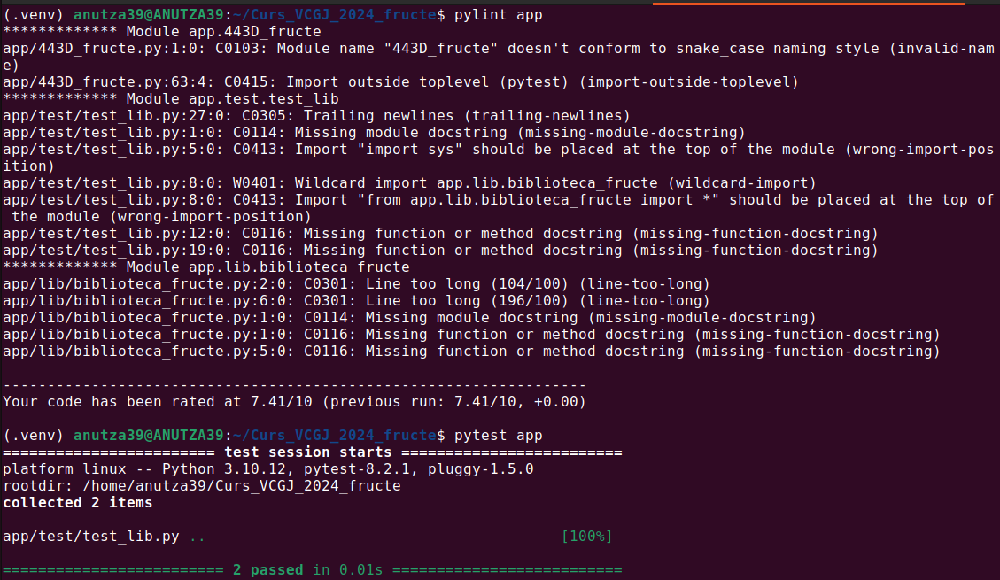

# Proiect VCGJ 2024 - fructe

_Functionalitate Ana-Ioana Cristescu: mere_


## Cuprins

1. [Descriere aplicatie](#descriere-aplicatie)
	1. [Rute](#rute)
2. [Pregatire mediu de lucru](#pregatire-mediu-de-lucru)
3. [Lintare & testare](#lintare--testare)
4. [Rulare aplicatie](#rulare-aplicatie)
	1. [Rulare locala](#rulare-locala)
	2. [Rulare folosind Docker](#rulare-folosind-docker)
5. [Continuous Integration](#continuous-integration)
6. [Flow Git](#flow-git)


## Descriere aplicatie

Aplicatia 443D_fructe ruleaza local, ori prin Docker. Ea ofera detalii despre  fructul "mar" sub forma unui site web cu rute specifice. Poate fi executata doar pe Linux si a fost testata pe Ubuntu 22.04. Componenta WEB a aplicatiei se bazeaza pe framework-ul Flask. Informatiile sunt preluate din biblioteca aflata in folder-ul `lib` si sunt afisate folosind functiile Flask de tip view specifice fiecarei pagini, apoi returnate clientului WEB care apeleaza serverul.

Aplicatia include suport pentru containerizare prin fisierul Dockerfile din directorul principal al aplicatiei.

### Rute

- ruta standard '/' - URL : http://127.0.0.1:5000/
- rute in aplicatia WEB specifice fructului "mar", care se adauga:
	- fruct: '/apple'- URL: http://127.0.0.1:5000/apple
	- culoare: '/apple/color' - URL: http://127.0.0.1:5000/apple/color
	- descriere: '/apple/description' - URL: http://127.0.0.1:5000/apple/description


## Pregatire mediu de lucru

1. Se face clone la repository-ul de git:

   
```shell
git clone https://github.com/beluflorentina/Curs_VCGJ_2024_fructe.git
cd Curs_VCGJ_2024_fructe
```

2. Branch-ul de lucru este `devel_Cristescu_Ana`:

```shell
git checkout devel_Cristescu_Ana
```

3. Creare mediu virtual si activare

```shell
python3 -m venv .venv
. .venv/bin/activate`
```

4. Instalare pachete:

```shell
pip install flask, pytest, pylint
```


## Rulare aplicatie

### Rulare locala

Aplicatia poate fi rulata local, dupa ce au fost urmati pasii de mai sus, folosind comanda:

```shell
flask --app=app.443D_fructe run
```

  
_Exemplu rulare locala_

### Rulare folosind Docker

De asemenea, aplicatia poate fi rulata sub forma unui container folosind Docker:

```shell
docker build -t image-apple .
docker run -p 5000:5000 image-apple
```

  
_Exemplu rulare cu Docker_


## Lintare & testare

Pentru a asigura calitatea codului, se foloseste `pylint` pentru aspectul codului si `pytest` pentru unit testing. Tool-urile se ruleaza asa:

```shell
pylint app
pytest app
```

  
_Rezultat rulare lint & test_


## Continuous Integration

Pentru CI, se foloseste Jenkins. Pipeline-ul de Jenkins, definit in `Jenkinsfile`, are urmatoarele etape:
- **build** - se creeaza environment-ul de Python si se instaleaza dependintele
- **lint** - se verifica calitatea codului folosind `pylint`
- **test** - se ruleaza unit testele folosind `pytest`, pipeline-ul este oprit daca testele esueaza
- **deploy** - se face build la imaginea Docker si se creeaza un container cu imaginea noua

  
_Build de Jenkins_

  
_Rulare unit tests ca parte a build-ului Jenkins_


# Flow Git

Flow-ul de development cu Git/GitHub este urmatorul:
1. Clonare repository si comutare pe branch-ul `devel_Cristescu_Ana`.
2. Efectuare modificari (commits)
3. Push in branch-ul remote `devel_Cristescu_Ana`
4. De pe site-ul GItHub se creeaza un pull request din `devel_Cristescu_Ana` in `main_Cristescu_Ana`
5. Pull request-ul este reviewed si aprobat de un coleg, apoi poate fi merged
6. Se iau cu `git pull` modificarile integrate pe `main_Cristescu_Ana`

