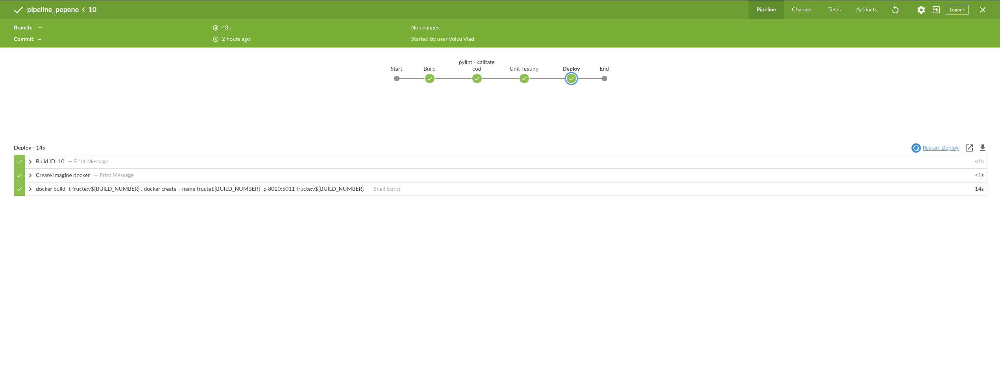

# Curs_VCGJ_2024_fructe

 ```Curs_VCGJ_2024_fructe_pepene```

# Cuprins

1. [Descriere aplicatie](#descriere-aplicatie)
2. [Descriere versiune](#descriere-versiune)
3. [Setup si rulare aplicatie](#configurare)
   - [Rulare aplicatie prin Flask](#rulare-aplicatie-prin-flask)
   - [Rulare aplicatie prin Docker](#rulare-aplicatie-prin-docker)
4. [Jenkins](#Jenkins)

# Introducere

Proiectul prezent își propune să demonstreze procesul de configurare și implementare a unei aplicații web utilizând o mașină virtuală. În cadrul acestui proiect, vom parcurge etapele necesare pentru instalarea și configurarea diverselor instrumente software esențiale pentru dezvoltarea unei aplicații web, evidențiind importanța fiecărei componente individuale.

Componenta WEB a aplicatiei se bazeaza pe framework-ul `Flask`.
Ca si functionare, aplicatia are un fisier de library definit in app/lib/biblioteca_fructe.py unde se regasesc functiile folosite in aplicatie. Acestea returneaza fructul, culoarea si o descriere despre fructul ales.

Pagina principala afiseaza o lista de fructe, iar accesand unul din itemele listei se redirectioneaza catre pagina cu detalii despre fructul respectiv.

Aplicatia include suport pentru containerizare in fisierul `Dockerfile`  din directorul principal al aplicatiei, impreuna cu un fisier Jenkins pentru crearea unui pipeline.

# Descriere versiune
 Link-urile către pagini pot fi accesate prin:

ruta standard: http://127.0.0.1:5000

rutele aplicației web:

fructe: http://127.0.0.1:5000/pepene

culoare: http://127.0.0.1:5000/pepene/culoare

descriere: http://127.0.0.1:5000/pepene/descriere


# Setup si rulare aplicatie


```
sudo apt install git
sudo apt update
sudo apt upgrade -y
sudo apt install python3
sudo apt install python3-pip
sudo apt-get install python3-venv
pip flask
pip docker.io
pip geditor
pip jenkins

```

Pentru instalare Docker Engine, se pot urmari si instructiunile de la link-ul urmator:
https://docs.docker.com/engine/install/ubuntu/#install-using-the-repository


Se cloneaza aplicatia:

```
git clone https://github.com/beluflorentina/Curs_VCGJ_2024_fructe.git

cd Curs_VCGJ_2024_fructe
```
## Rulare aplicatie prin Flask

Se activeaza virtual environment-ul pentru a avea acces la Flask:

```
source .venv/scripts/common/activate
```

Pentru rularea aplicatiei folosind Flask:
```
flask --app app/443_fructe.py run
```

## Rulare aplicatie prin Docker

Pentru rularea aplicatiei folosind Docker, se ruleaza urmatoarele comenzi:

```
sudo docker build -t pepene .
docker images 
sudo docker run -dp 127.0.0.1:5000:5000 <pepene:versiunea gasita dupa comanda antecedenta>
```

Pentru a lista containerele docker care ruleaza, se foloseste comanda
```
sudo docker ps
```


In continuare aplicatia va rula tot la 127.0.0.1:5000

## Jenkins

Jenkins este un server de automatizare open-source care facilitează automatizarea diverselor activități legate de dezvoltarea software, precum construirea, testarea și implementarea aplicațiilor. Utilizarea Jenkins ne ajută să economisim timp și să minimizăm erorile umane în procesul de dezvoltare.

**Cum funcționează Jenkins?**

Jenkins funcționează prin intermediul joburilor și pipeline-urilor. Un job este o sarcină individuală de automatizare, care poate include procese de construire, testare sau implementare a unui proiect software. Pipeline-urile sunt secvențe de joburi interconectate care configurează întregul proces de livrare a software-ului.

Jenkins poate prelua codul sursă din diverse sisteme de control al versiunilor, precum Git. După preluarea codului, Jenkins rulează scripturile de construire, cum ar fi cele de Gradle, pentru a compila codul. Odată compilarea finalizată, Jenkins rulează teste automate pentru a verifica dacă noul cod introduce erori.

Pipeline-ul creat pentru aplicatia noastra:


## Ocean Blue




